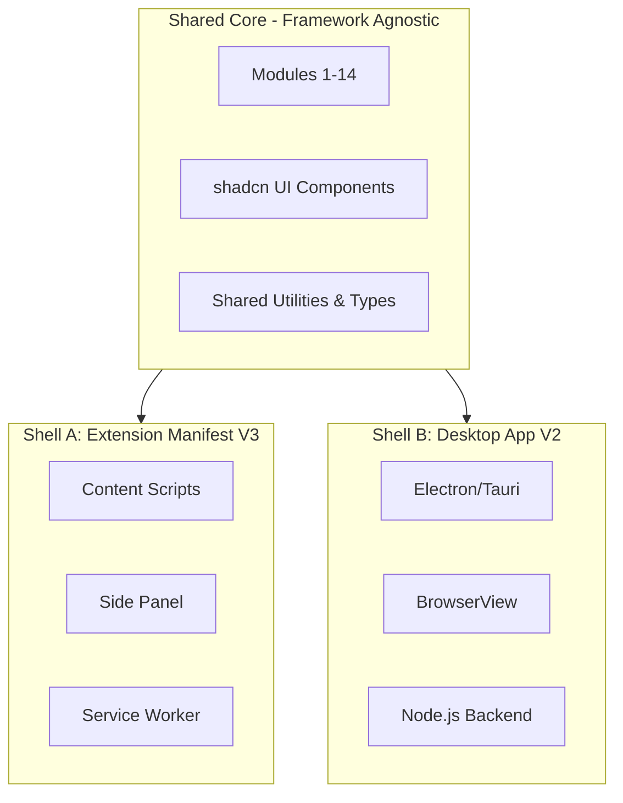
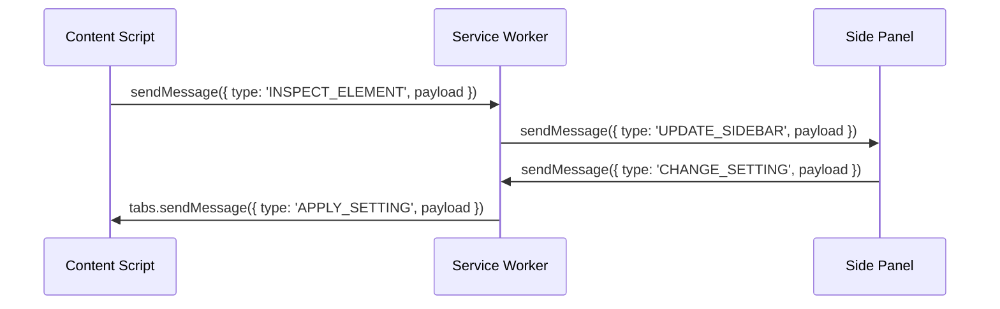

# DevLens Blueprint: Core Architecture & Specifications

This document outlines the core architecture, technology stack, and project structure for DevLens. Read this thoroughly before implementing any modules or features.

## 1. Project Overview

- **DevLens** is an all-in-one browser extension combining 69 non-AI features across 14 modules.
- **Tagline:** "See through any website" — inspect, extract, clone, debug, audit.
- **Target users:** Frontend/full-stack developers, UI/UX designers, SEO specialists, QA engineers.
- **Positioning:** Combines the best of SuperDev Pro (50+ tools), Hoverify (hover-to-inspect), MiroMiro (design-to-code), Picker.Design (page cloning), toast.log (console toasts), and LoupeKit (75+ tools with AI detection).
- **Privacy-first:** 100% local processing, no telemetry, no external servers.
- **Pricing model:** Freemium — core tools free, advanced features paid (one-time lifetime license).

## 2. Tech Stack

- **Sidebar HUD (Layer 2):** React 18+ / TypeScript (strict) / Tailwind CSS 4 / shadcn/ui (~25 components) / cmdk (via shadcn Command). 
  *Why:* React + shadcn provides a robust, accessible, and fast way to build complex, stateful UIs. Tailwind allows rapid styling.
- **On-page Overlays (Layer 1):** Vanilla TypeScript / Custom CSS scoped via Shadow DOM / Canvas API for rulers+measurement / Zero dependencies. 
  *Why:* Global CSS must never conflict with the host page. Vanilla TS ensures 60fps performance for cursor-following highlights, where React rendering cycles are too slow.
- **Background:** TypeScript / chrome.* extension APIs / Message passing hub.
- **Build:** Vite + CRXJS / Code splitting per module / Separate bundles: sidebar, content, worker.
  *Why:* CRXJS enables Vite's fast HMR (Hot Module Replacement) during extension development.
- **Testing:** Vitest for unit tests / Playwright for integration.
- **Linting:** ESLint + Prettier + TypeScript strict mode.

## 3. Path C Architecture (Extension First → Desktop Later)

DevLens follows a "Path C" progressive enhancement architecture:

- **Phase 1:** Browser Extension (V1) — ships with 60 features covering 86% of capability.
- **Phase 2:** Desktop App (V2) — Electron or Tauri wrapper, adds multi-viewport, terminal, file system capabilities.

### Shared Core Architecture Diagram



Code organization strictly separates business logic (Core) from environment execution contexts (Shell A/B).

## 4. Extension Architecture (Manifest V3)

DevLens uses Manifest V3 architecture with three primary execution contexts:

1. **Content Script:** Injected into every page. Creates Shadow DOM host. Manages Layer 1 overlays. Communicates with sidebar via chrome.runtime messaging.
2. **Service Worker (Background):** Handles chrome.tabs, chrome.cookies, chrome.webRequest, chrome.downloads, chrome.scripting. Coordinates between content script and sidebar. Manages extension lifecycle.
3. **Side Panel:** React app rendered in Chrome's Side Panel API. Contains all shadcn UI. Hosts the command palette and module panels. Communicates with content script via messaging.
4. **Popup (optional):** Minimal — just a quick-access launcher that opens the side panel.

### Message Flow Diagram



## 5. Dual UI System

DevLens splits UI into two distinct layers to handle performance and styling constraints:

- **Layer 1 (On-page):** Vanilla TS + CSS in Shadow DOM.
  - Used for: element highlights, box model overlays, rulers, grids, color picker crosshair, toast notifications, hover tooltips, element outlines, sticky notes.
  - **Constraints:** Must be ultra-lightweight (<50KB). Must never conflict with page CSS. Needs 60fps rendering without React overhead.
- **Layer 2 (Sidebar):** React + shadcn/ui.
  - Used for: command palette, module panels, settings, results display, code preview, audit reports. Full React app in Side Panel.
  - **Constraints:** shadcn uses Tailwind which relies on global CSS, but Shadow DOM blocks global CSS. Thus, React/Tailwind lives exclusively in the Side Panel or specific iframe contexts.

## 6. File/Folder Structure

```
devlens/
├── public/
│   ├── icons/                    # Extension icons (16, 32, 48, 128)
│   └── manifest.json             # Manifest V3
├── src/
│   ├── core/                     # Shared core (shell-agnostic)
│   │   ├── modules/              # 14 feature modules
│   │   │   ├── css-inspector/
│   │   │   ├── dom-manipulator/
│   │   │   ├── code-exporter/
│   │   │   ├── color-tools/
│   │   │   ├── typography/
│   │   │   ├── layout-measurement/
│   │   │   ├── asset-extractor/
│   │   │   ├── page-capture/
│   │   │   ├── design-system/
│   │   │   ├── seo-accessibility/
│   │   │   ├── tech-stack/
│   │   │   ├── debug-monitor/
│   │   │   ├── command-center/
│   │   │   └── utilities/
│   │   ├── types/                # Shared TypeScript types
│   │   └── utils/                # Shared utilities
│   ├── extension/                # Extension shell (Shell A)
│   │   ├── content/              # Content script + Shadow DOM
│   │   │   ├── index.ts
│   │   │   ├── shadow-host.ts
│   │   │   ├── overlays/         # Layer 1 on-page UI
│   │   │   └── styles/           # Scoped CSS for overlays
│   │   ├── sidebar/              # Side Panel React app (Layer 2)
│   │   │   ├── App.tsx
│   │   │   ├── components/       # shadcn-based components
│   │   │   ├── pages/            # Module page views
│   │   │   └── hooks/            # React hooks
│   │   ├── worker/               # Service Worker (background)
│   │   │   └── index.ts
│   │   ├── popup/                # Optional popup launcher
│   │   └── messaging/            # Message passing utilities
│   ├── ui/                       # shadcn/ui components
│   │   ├── components/           # All shadcn components
│   │   └── lib/                  # UI utilities (cn, etc.)
│   └── styles/
│       ├── tailwind.css           # Tailwind entry
│       └── overlay.css            # Layer 1 styles
├── tests/
├── scripts/
├── .agents/                       # Antigravity skills
│   └── skills/
├── package.json
├── tsconfig.json
├── vite.config.ts
├── tailwind.config.ts
├── components.json                # shadcn config
└── README.md
```

## 7. Module Architecture

Each module in `src/core/modules/<name>/` strictly follows this structure:
- `index.ts` — public API (exported functions)
- `types.ts` — TypeScript interfaces
- `utils.ts` — module-specific helpers
- `constants.ts` — module constants

**Rules:**
1. Modules are lazy-loaded via dynamic imports to keep initial bundle size small.
2. Modules communicate via a shared event bus, not direct imports, to prevent circular dependencies.
3. **Dependency Graph:** 
   - 10 of 14 modules are fully independent.
   - M3 (Code Exporter) depends on M1 (CSS Inspector).
   - M9 (Design System) depends on M4 (Color) + M5 (Typography).
   - M13 (Command Center) integrates with all modules.

## 8. State Management

- **Sidebar State:** Use Zustand. It is lightweight, unopinionated, and works seamlessly with React.
- Each module has its own independent store slice.
- **Content Script State:** Plain TypeScript (no React).
- Cross-context state synchronization is handled via `chrome.runtime` messaging.

*Example Zustand Slice:*
```typescript
import { create } from 'zustand';

interface ColorStore {
  pickedColors: string[];
  addColor: (color: string) => void;
}

export const useColorStore = create<ColorStore>((set) => ({
  pickedColors: [],
  addColor: (color) => set((state) => ({ pickedColors: [...state.pickedColors, color] })),
}));
```

## 9. Message Passing

Define all message types as TypeScript discriminated unions to guarantee type safety across extension contexts.

*Pattern:*
```typescript
type ModuleAction = 
  | { type: 'MODULE_ACTION'; module: 'color'; action: 'PICK_COLOR'; payload: { hex: string } }
  | { type: 'MODULE_ACTION'; module: 'css'; action: 'INSPECT'; payload: { selector: string } };
```

*Routing:*
- Content → Worker: `chrome.runtime.sendMessage()`
- Worker → Content: `chrome.tabs.sendMessage(tabId, ...)`
- Sidebar → Worker: `chrome.runtime.sendMessage()`
- Worker → Sidebar: `chrome.runtime.sendMessage()` (Side panel shares extension context)

## 10. Storage Strategy

- `chrome.storage.local`: Persistent settings (theme, shortcuts, enabled modules, license keys). Max capacity is around 10MB.
- `chrome.storage.session`: Temporary data (current inspection results, active tab states) that clears when the browser closes.
- Define explicit TypeScript schemas for all stored data to validate runtime loads.

## 11. Coding Conventions

- **File naming:** `kebab-case` for files, `PascalCase` for React components.
- **Export pattern:** Named exports only. Do not use default exports to simplify refactoring.
- **Error handling:** Use a `Result<T, E>` pattern. Never throw unhandled exceptions in module code.
- **Comments:** JSDoc for public APIs, inline comments only for complex algorithms.
- **Types:** No `any` types. Use `unknown` with type guards.
- **Design:** Prefer composition over inheritance.
- **Testing:** Each module must be independently testable in isolation.

## 12. Versioning & Release Plan

- **V1.0:** P0 features (15 core features) — MVP launch.
- **V1.x:** P1 features (30 features) — rapid iteration.
- **V1.5:** P2 features (24 features) — full extension capability.
- **V2.0:** AI layer (8 features) — BYOK (Bring Your Own Key) premium tier.
- **V3.0:** Desktop app (9 desktop-only features) — Electron/Tauri rollout.
- **SemVer** for public releases, Chrome Web Store handles auto-update.

## 13. Monetization

- **Free tier:** Core inspection (M1), color picker, font detection, screenshots, command palette.
- **Paid (one-time lifetime):** Code export, page cloning, design tokens, tech stack detection, debug monitor, data scraping, full audit suite.
- **No subscriptions, no recurring fees.**
- Licensing via Gumroad or LemonSqueezy + license key validation stored locally.
